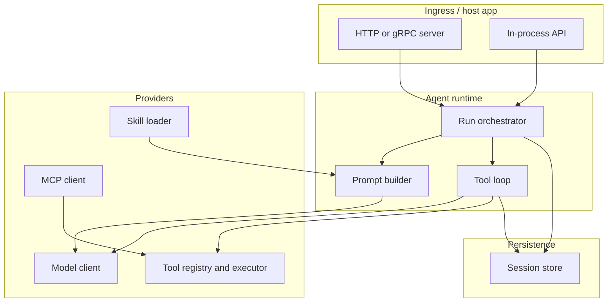
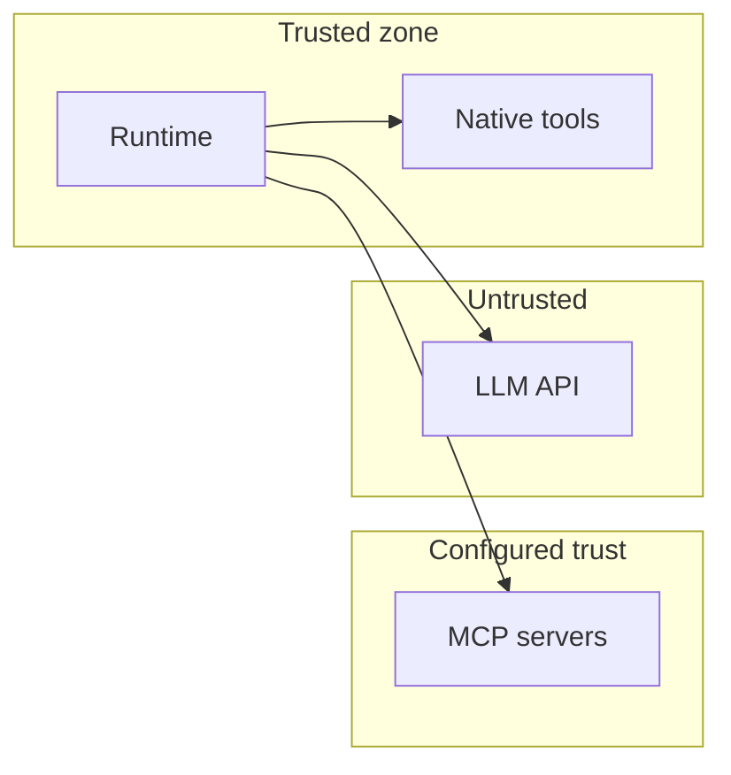

# Architecture

This document describes the **target architecture** for CentrAI Agent as a **Go** library (and optional embedded service). It aligns with the foundation docs ([agents](1.%20agents.md) through [skills](7.%20skills.md)) and the code under `internal/` and `cmd/`; extend it when behavior evolves. The [`temp/agno`](../temp/agno) tree is a **reference implementation** (Python) for concepts only, not a dependency.

## Discovery (repository state)

| Area | Status |
|------|--------|
| `docs/` | Foundation topics and this architecture doc |
| Root `README.md` | Project intent: Go runtime for performance and concurrency |
| Go source | Present (`go.mod`, `internal/*`, `cmd/centrai`); structure below remains the target shape |
| `temp/agno/` | Upstream Agno codebase (optional comparison; see [Agno agents](https://docs.agno.com/agents/overview)) |

## Goals and constraints

- **Hot path in Go** — Session routing, history assembly, tool dispatch, MCP I/O, and persistence orchestration run in-process for predictable CPU and memory use.
- **Model out-of-process** — LLMs are accessed over HTTP (or compatible APIs); no requirement to embed inference.
- **Swappable backends** — Storage, model providers, and tool sources (native vs MCP) sit behind small interfaces.
- **Cancellable work** — Long runs and tool calls respect `context.Context` for deadlines and client disconnects.
- **Streaming-first model I/O** — Each model round uses the provider’s **streaming** chat API (token/chunk events). The orchestrator forwards incremental output to the host for UX, then drives the tool loop from a **completed** assistant step (final text and/or tool calls). See [MVP](MVP.md) for first-version scope; a separate non-streaming HTTP completion-only path is **not** required for MVP.

## Logical layers

CentrAI Agent is organized as **layers** with **one-way dependencies** (upper layers depend on lower; not the reverse).



| Layer | Responsibility |
|-------|----------------|
| **Ingress** | Your API: auth, rate limits, mapping HTTP/gRPC to a **Run** request (user id, session id, message, options). |
| **Run orchestrator** | Loads session, applies hooks, enforces max iterations, emits events, persists results. |
| **Prompt builder** | Merges system instructions, [skills](7.%20skills.md), session state, truncated history, and tool definitions for the [model](2.%20models.md). |
| **Tool loop** | Parses model output; validates tool calls; runs handlers with timeouts; appends tool messages; repeats until done or limit. |
| **Model client** | Streaming chat API: request serialization, **chunk/token events**, reassembly into a final assistant step, error mapping. |
| **Tool registry** | Name → schema + handler; middleware chain (logging, redaction, policy). |
| **MCP client** | Discovers remote tools and forwards invocations into the same registry path ([MCP](6.%20mcps.md)). |
| **Session store** | [Sessions, messages, state](5.%20session-management.md) via [storage adapters](4.%20databases.md). |

## Core runtime sequence

A single **run** (one user turn, possibly many model rounds) follows this sequence:

```mermaid
sequenceDiagram
  participant C as Caller
  participant O as Orchestrator
  participant S as Session store
  participant P as Prompt builder
  participant M as Model client
  participant T as Tool executor

  C->>O: Run(ctx, sessionID, userMessage)
  O->>S: Load session and history
  S-->>O: Session + messages + state
  loop Tool loop until finish or max steps
    O->>P: Build messages + tools
    P-->>O: Provider payload
    O->>M: Stream(ctx, payload)
    M-->>O: Chunk/token events (forwarded); then assistant message or tool calls
    alt Tool calls
      O->>T: Execute each call (ctx, timeout)
      T-->>O: Tool results
    else Final text
      O->>S: Append messages, update state
      O-->>C: Run output
    end
  end
```

**Streaming semantics**

- The **model client** opens a **stream** (e.g. SSE or chunked HTTP), parses provider deltas, and exposes **incremental events** (channel, callback, or iterator—implementation detail).
- The **orchestrator** forwards those events to the **caller/ingress** for live UX; it does **not** execute tools on partial fragments unless the provider defines tool deltas mid-stream (uncommon—most APIs finish tool calls at stream end).
- After the stream completes (or the final delta is known), the client yields one **assistant step**: assistant text and/or **tool calls** for the tool loop—same as the non-streaming mental model, but **always** reached via streaming I/O.
- **Cancellation**: aborting `ctx` tears down the HTTP body and stops forwarding; tool work uses separate deadlines where needed.

## Interface boundaries (Go)

These are **conceptual** packages and interfaces; exact names may change when code lands.

| Boundary | Purpose |
|----------|---------|
| `agent.Runner` | High-level entry: `Run(ctx, *RunInput) (*RunOutput, error)` |
| `model.Client` | **Streams** chat requests; emits chunk/token events; returns a final assistant message + tool calls per round (streaming is the primary contract; see [MVP](MVP.md)) |
| `tool.Registry` | Registers tools; builds OpenAI-style tool list; dispatches by name |
| `mcp.Host` | Connects servers; lists tools; implements invocation as `tool.Handler` |
| `session.Store` | CRUD sessions, append messages, merge [session state](5.%20session-management.md) |
| `skill.Loader` | Resolves skill names/paths into instruction fragments for the prompt builder |

Keeping **domain types** (message, tool call, session) in a small `types` or root package avoids import cycles between `model`, `tool`, and `session`.

## Concurrency model

- **One run** should be driven by **one goroutine** for the main loop; use derived contexts for per-step deadlines (e.g. per-tool timeout).
- **Parallel tool calls** (when the model returns many): optional `errgroup` or worker pool with a cap; aggregate results in deterministic order for replay.
- **MCP and HTTP** clients use `http.Client` with bounded idle connections; avoid unbounded goroutines per request.
- **Store**: prefer connection pools (SQL/Redis); for SQLite, serialize writes per DB if needed.

## Data and trust boundaries



- **LLM responses** are untrusted input: validate tool names and JSON arguments against schemas before dispatch.
- **MCP** runs out-of-process: treat as privileged only after explicit admin configuration; apply network policy and secrets injection per server.

## Observability

- **Structured events** along the run lifecycle: `run_start`, `model_stream_start`, `model_chunk` (optional, high-volume), `model_stream_end`, `tool_start`, `tool_end`, `run_end` (with latency and error fields). Exact names may vary; preserve ordering and correlation ids for traces.
- **Tracing**: propagate trace IDs from ingress through model and tool spans.
- **Logging**: never log raw secrets or full prompts in production unless policy allows; redact in middleware.

## Deployment shapes

| Shape | Description |
|-------|-------------|
| **Library** | Import CentrAI Agent inside your service; you own HTTP routes and auth. |
| **Sidecar / worker** | Same binary with a thin gRPC/HTTP server for agent runs only; main app calls it. |
| **CLI** | Thin wrapper for debugging and scripts; session store may be local SQLite. |

## Future extensions (non-foundation)

The foundation docs scope **single-agent** runs first. **Teams** and **workflows** can be separate packages that compose multiple `Runner` calls and shared `session.Store`, without changing the core loop contract.

## Related documents

| Topic | Document |
|-------|----------|
| MVP (first version scope) | [MVP](MVP.md) |
| Agent loop and goals | [1. agents](1.%20agents.md) |
| Models | [2. models](2.%20models.md) |
| Tools | [3. tools](3.%20tools.md) |
| Storage | [4. databases](4.%20databases.md) |
| Sessions | [5. session-management](5.%20session-management.md) |
| MCP | [6. mcps](6.%20mcps.md) |
| Skills | [7. skills](7.%20skills.md) |
| Code structure | [9. code-structure](9.%20code-structure.md) |

---

*Previous: [7. skills](7.%20skills.md) · Next: [9. code-structure](9.%20code-structure.md)*
