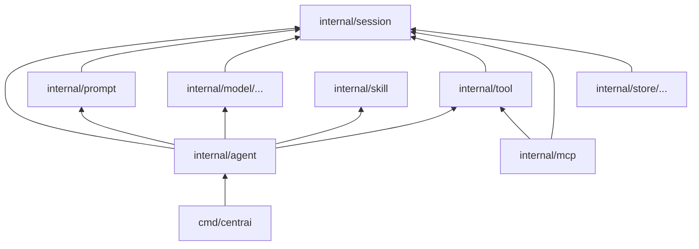

# Code structure (Go best practices)

This guide defines how to organize **CentrAI Agent** Go code so it stays **easy to navigate**, **free of import cycles**, and **aligned** with [architecture](8.%20architecture.md). Apply it when you add `go.mod`; replace example module paths with your real module path.

**Who should read this**

- Anyone adding packages or binaries to this repo.
- Anyone integrating the library and wondering where types and interfaces live.

**Principles (short)**

1. **Thin entrypoints** — `cmd` only wires config and dependencies.
2. **Domain in the middle** — shared types and contracts live in small packages everyone imports upward.
3. **Adapters at the edge** — databases and HTTP clients implement interfaces defined above them.
4. **No upward imports** — lower layers never import orchestration (`agent`).

---

## 1. Full repository layout (recommended)

Two common shapes are supported: **library-first** (no `cmd` initially) or **service + library** (default below).

```
.
├── cmd/
│   └── centrai/                 # main: CLI, dev API server, or worker
│       ├── main.go
│       └── config.go            # env/flags only; maps into internal config structs
│
├── internal/
│   ├── agent/                   # Run orchestrator, tool loop, hooks, events
│   │   ├── runner.go            # NewRunner, Run(ctx, *RunInput)
│   │   ├── loop.go              # iteration until done / max steps
│   │   ├── hooks.go             # optional pre/post run
│   │   └── events.go            # structured run lifecycle events
│   │
│   ├── prompt/                  # Build chat messages + tool list for the model
│   │   └── builder.go
│   │
│   ├── model/                   # LLM providers (HTTP); streaming
│   │   ├── client.go            # interface Model / Client
│   │   ├── openai/              # one subfolder per provider family
│   │   └── anthropic/
│   │
│   ├── tool/                    # Registry, JSON Schema validation, execution, middleware
│   │   ├── registry.go
│   │   ├── executor.go
│   │   └── middleware.go
│   │
│   ├── mcp/                     # MCP client; exposes tools into the same registry path
│   │   ├── client.go
│   │   └── transport_*.go       # stdio / HTTP as implemented
│   │
│   ├── session/                 # Domain types + storage interfaces (no drivers)
│   │   ├── types.go             # Session, Message, ToolCall, Role
│   │   └── store.go             # Store interface(s)
│   │
│   ├── store/                   # Store implementations only
│   │   ├── memory/
│   │   ├── sqlite/
│   │   └── postgres/
│   │
│   ├── skill/                   # Load skills from disk or registry
│   │   └── loader.go
│   │
│   └── agentdef/                # Load agent defs from YAML or Markdown + YAML front matter
│       └── agentdef.go
│
├── .centrai/                    # OPTIONAL: project-local agents, skills, MCP notes
│   ├── agents/                  # Example .md / .yaml for cmd/centrai -agent
│   └── skills/                  # Markdown skill checklists (docs; not Go-loaded yet)
│
├── pkg/                         # OPTIONAL: stable types for external integrators
│   └── api/                     # e.g. v1 JSON DTOs or protobuf bindings
│
├── docs/                        # Design documentation
├── go.mod
├── Makefile                     # optional: test, lint, build
└── README.md
```

**What each top-level folder is for**

| Path | Role |
|------|------|
| `cmd/*` | `package main` only. Parse OS config; construct `internal` types; start servers. No business rules here. |
| `internal/*` | All runtime logic. Other modules **cannot** import `internal` (Go enforcement). |
| `.centrai/agents/` | Example and user agent files (`.md` with front matter or `.yaml`) for `cmd/centrai -agent` (not Go code). |
| `pkg/*` | Only if third parties must depend on **stable** structs or generated API types. If everything imports your module root, you may skip `pkg` and export from a top-level package instead. |
| `docs/` | Human-written architecture and product docs (not godoc). |

**Library-only variant**

- Omit `cmd/` until you need a binary.
- Optionally add a root file `agent.go` with `package centrai` (or `package agent`) that re-exports `NewRunner` from `internal/agent` so users import `github.com/org/centrai-agent` once. Document the chosen pattern in `README.md` and do not mix two styles.

---

## 2. Package map (ownership and imports)

Each package should have **one clear job**. This table is the main reference when you are unsure where code belongs.

| Package | Owns | May import | Must not import |
|---------|------|------------|-----------------|
| `session` | `Message`, `Session`, `ToolCall`, `Store` **interfaces** | standard library only (ideally) | `agent`, `model`, `store`, `tool` |
| `agent` | Run lifecycle, max iterations, tool loop, calling prompt/model/tools | `session`, `prompt`, `model`, `tool`, `skill` | concrete `store/*`, HTTP routers |
| `prompt` | Assembling prompts from instructions, history, skills | `session` | `agent` (keep it pure) |
| `model` | HTTP/SDK adapters to LLM APIs | `session` (types only) | `tool`, `agent` |
| `tool` | Registry, validation, middleware, executing handlers | `session` | `agent` |
| `mcp` | Discovery + invoke; adapt to `tool` contracts | `tool`, `session` | `agent` |
| `store/*` | `session.Store` implementations | `session`, DB drivers | `agent` |
| `skill` | Resolve skill text/paths | `session` (if needed for context types only) | `model` |
| `agentdef` | Parse agent YAML into structs (no I/O except file load helpers) | standard library, `yaml` | `agent`, `model`, `tool` |

**Where to put shared structs**

- Prefer **`internal/session`** for chat domain types so `model`, `tool`, and `agent` share one definition of `Message` and `ToolCall`.
- If `session` grows too large, split **`internal/session/types.go`** vs **`internal/session/store.go`** (interfaces), not new packages until necessary.

---

## 3. Dependency direction (enforced mentally)

Allowed dependency flow:



**Rules**

- **`agent` is the orchestrator** — it knows about prompt, model, tool, skill, and `session.Store`.
- **`store` implements `session.Store`** — it depends on `session` interfaces, never on `agent`.
- **`model` maps wire formats to `session` types** — it does not execute tools or import `tool`.

Use **constructor injection** (`NewRunner(... session.Store, model.Client, *tool.Registry)`) instead of package-level singletons.

---

## 4. Naming conventions

| Kind | Convention | Examples |
|------|------------|----------|
| **Package** | Short, lowercase, no underscores | `agent`, `session`, `tool`, `openai` |
| **Files** | `snake` for multi-word if needed; otherwise one word | `runner.go`, `store_postgres.go` |
| **Types** | Exported nouns for domain | `Runner`, `Message`, `Store` |
| **Constructors** | `NewX` or `NewXWithY` | `NewRunner`, `NewOpenAIClient` |
| **Interfaces** | Consumer-defined; often `-er` or role name | `Store` (in `session`), `Client` (in `model`) |

Avoid a package named `util` or `common`; put helpers next to the only caller or in a narrowly named package (e.g. `jsonutil` only if widely shared).

---

## 5. Files, size, and tests

- **Split files** when a file passes ~400 lines or mixes unrelated concerns (e.g. do not put streaming and batch APIs in one file unless tiny).
- **Tests** live beside code: `runner_test.go`.
- **Golden / fixtures**: `testdata/` per package (`testdata/openai/chat_response.json`).
- **Integration tests**: suffix `_integration_test.go` with `//go:build integration` so default `go test` stays fast.
- **Generated code**: separate file, header `// Code generated ... DO NOT EDIT.`

---

## 6. Interfaces and testing

- Define **small interfaces** at the **consumer** when useful (`session.Store` consumed by `agent`).
- Prefer **accept interfaces, return structs** for public constructors (`func NewRunner(store session.Store) *Runner`).
- For tests: **fakes** in `internal/agent/fakes_test.go` or `package agent_test` with hand-written `Store` / `Model` stubs that return scripted sequences.
- HTTP: **`httptest.Server`** in `model` tests; avoid real network in unit tests.

---

## 7. Errors, context, and logging

- Wrap with **`fmt.Errorf("...: %w", err)`**; expose **`var ErrX = errors.New(...)`** for stable comparisons.
- **`context.Context`** first parameter on anything that blocks (`Run`, `Complete`, tool `Execute`).
- **Logging**: inject `slog.Logger` or a narrow interface in `Runner` options; core packages must not call `log` directly without configuration.

---

## 8. Configuration layers

| Layer | How config is supplied |
|-------|-------------------------|
| `internal/agent` | Structs: `RunnerConfig{ MaxSteps int; ... }` |
| `internal/model/openai` | `ClientConfig{ BaseURL, APIKey, Model string }` |
| `cmd/centrai` | Read env/flags; validate; build those structs |

Never read environment variables inside `internal` packages except in `cmd` (or a dedicated `internal/config` loader called only from `cmd`).

---

## 9. Concurrency

- Document **whether `Runner` allows concurrent `Run` calls** on the same instance (usually: safe if `Store` is safe, or document “one run per session goroutine”).
- **Parallel tool calls**: bounded worker pool or `errgroup` with semaphore; respect parent `ctx` cancellation.
- **Registry**: typically **immutable after init**; if mutable, protect with `sync.RWMutex` and document.

---

## 10. Module versioning and public API

- Use **Go modules** semver: breaking changes bump **major** (`v2` subdirectory or `/v2` import path).
- If you expose a minimal public surface, keep **exported names stable** and evolve via new optional fields on config structs rather than churning function signatures.

---

## 11. Tooling (recommended)

- **`golangci-lint`** with `staticcheck`, `govet`, `errcheck`, `revive` (or `staticcheck` alone at minimum).
- **`go test ./...`** in CI; optional **`integration`** job with tag.
- **Format**: `gofmt` / `goimports` on commit or CI.

---

## Related documents

| Topic | Document |
|-------|----------|
| Plan (roadmap + current code map) | [plan](plan.md) |
| System architecture | [8. architecture](8.%20architecture.md) |
| Agents | [1. agents](1.%20agents.md) |

---

*Previous: [8. architecture](8.%20architecture.md)*
